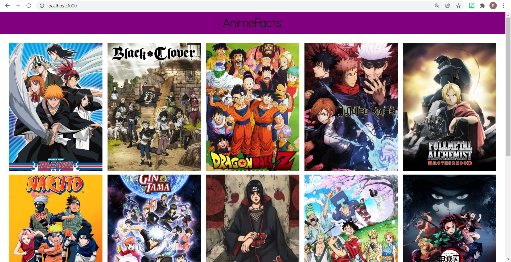
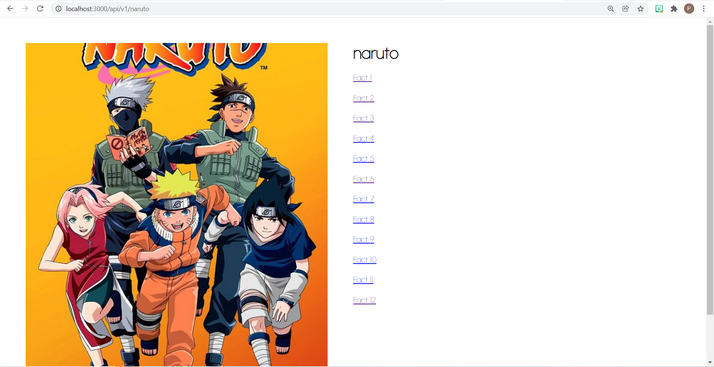
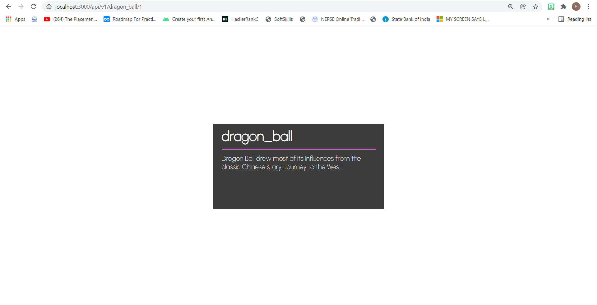
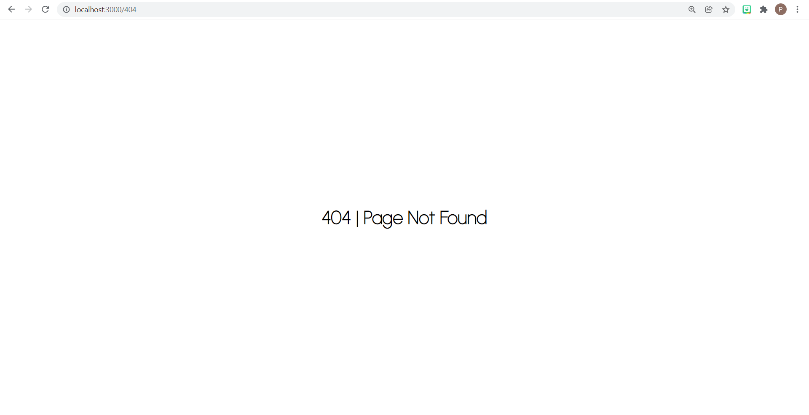

### Homepage

### Anime Page

### Fact

### Error

First of all, clone the project to your system and run the below commands

### `npm install`

To install all the dependencies

### `Use this API`
[Anime Facts API](https://chandan-02.github.io/anime-facts-rest-api/)
### `npm run start`
It will run the app